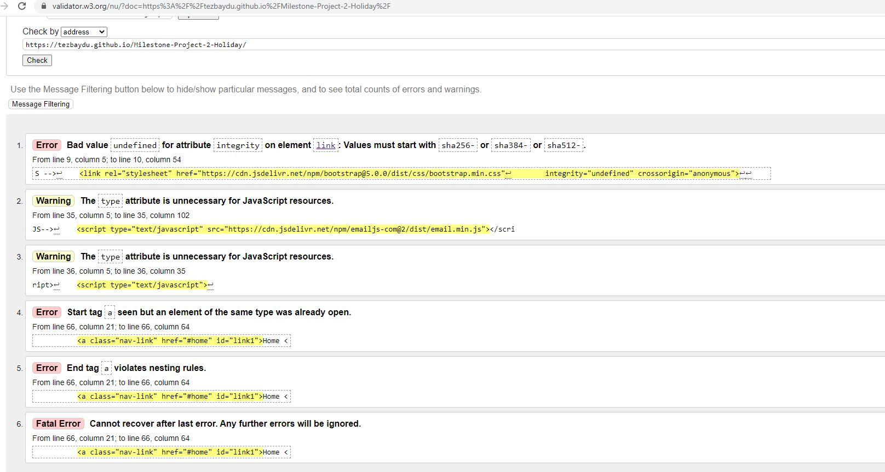
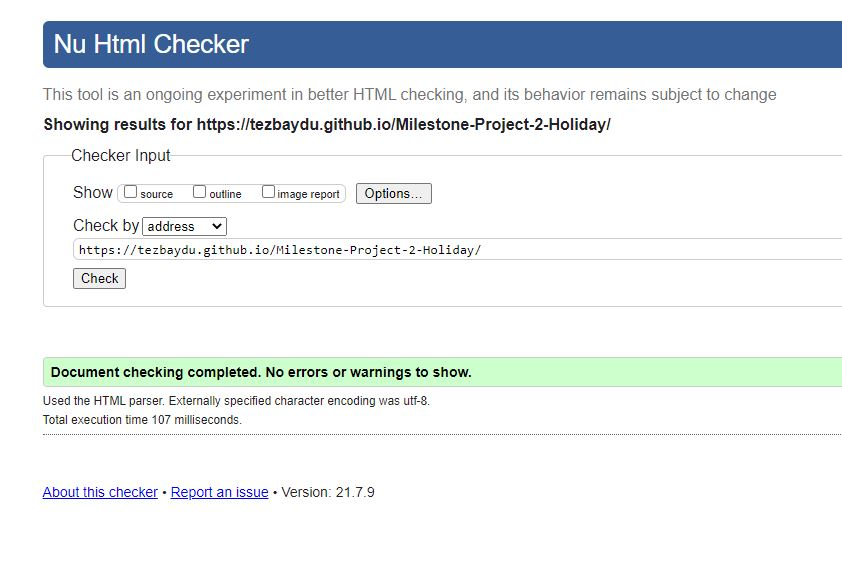
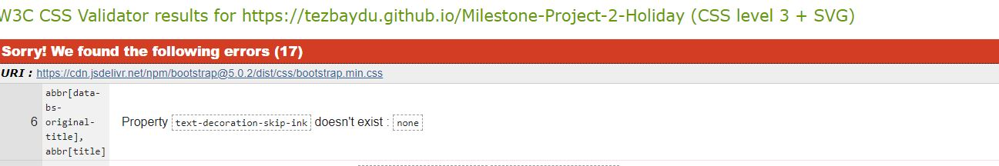
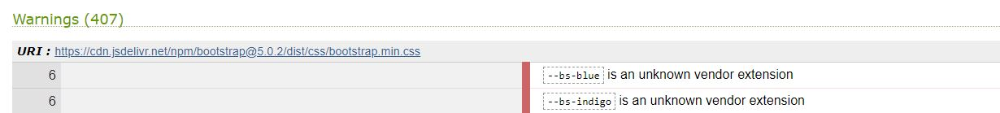
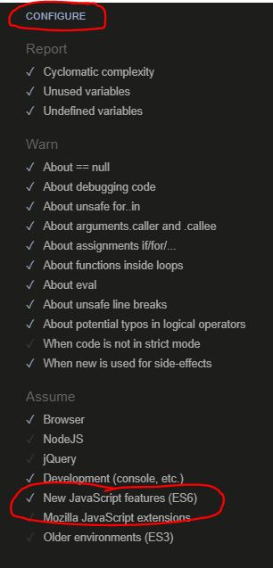
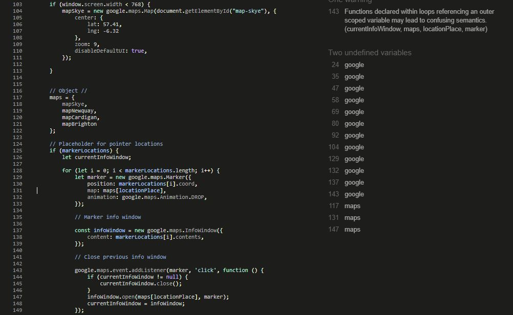

<h1 align ="center" id = "top">Project Staycation Britain Test file
<h1>

<h2 align="center">
    <a href="https://tezbaydu.github.io/Milestone-Project-2-Holiday" target="_blank">Staycation Britain Website</a>
</h2>

<h3 align="center">
    <a href="https://github.com/TezBaydu/Milestone-Project-2-Holiday#README" target="_blank">Back to README file</a>
</h3>

## Contents
1. [Commits](#Commits)
2. [User Story testing](#User-Story-testing)
    - [British Travellers](#British-Travellers)
    - [Web Developer](#Web-Developer)
3. [Code testing](#Code-testing)
    - [HTML5](#HTML5)
    - [CSS3](#CSS3)
    - [JavaScript](#JavaScript)
4. [Element testing](#Element-testing)
    - [Navigation bar](#Navigation-bar)
    - [Scroll Top button](#Scroll-Top-button)
    - [Footer](#Footer)
    - [Locations section](#Locations-section)
        * [Read More](#Read-More)
        * [Map Markers](#Map-Markers)
        * [Interest Cards](#Interest-Cards)
        * [Contact section](#Contact-section)
    - [Contact section](#Contact-section)
    - [Email format](#Email-format)
5. [Device testing](#Device-testing)
6. [Colour blindness testing](#Colour-blindness-testing)
    - [Protanopia](#Protanopia)
    - [Deuteranopia](#Deuteranopia)
7. [Browser testing](#Browser-testing)
8. [User testing](#User-testing)

## Commits
- Over 110 commits
- Commits made in as many instances as possible

[Back to top ⇧](#top)

## User Story testing

### British Travellers
The user is currently in Britain and not wanting to book any trips abroad.

* This user wants to:
1. Be able to navigate through the website easily.
    - Fixed top Nav bar showing sections to navigate to.
    - Fixed site logo on top left of nav bar for user to navigate to home section.
2. Understand what site is providing (at this stage).
    - Synopsis on Home section.
3. To be able to see and be aware of recommended locations and various elements associated with them.
4. To be able to navigate and interact with map to get better understanding of location.
5. Be able to navigate to relevant social links.
    - Footer at bottom with buttons directing to social sites.
6. Be able to contact site company and be part of newsletter/e-mail contact list.
    - Contact section has a form which has required fields to make contact.
    - Notification both on site and direct email to ensure response has been recieved.

### Web Developer
This user is looking for imagery or influence for another project.

* They want to be able to:
1. Have easy navigation.
    - Fixed top Nav bar..
    - Fixed logo on top left of nav bar for user to navigate to home page.
2. Find how the website was created.
    - [README.md](https://github.com/TezBaydu/Milestone-Project-2-Holiday#introduction) file created detailing why and how website was created.
    - Contact form can also be used for General enquiries.
3. Be able to make contact with Developer.
    - Contact form can be used for general enquiries.
    - [README.md Deployment](https://github.com/TezBaydu/Milestone-Project-2-Holiday#Deploying-via-GitHub-Pages) has description of cloning and forking and therefore contact can be made via GitHub.
4. Have an opportunity to clone site if wanting to use content.
    - [README.md Cloning](https://github.com/TezBaydu/Milestone-Project-2-Holiday#Cloning-a-repository) has description of cloning.

[Back to top ⇧](#top)

## Code Testing

### HTML5
- [HTML code checker](https://validator.w3.org/)
     
    - Test date 11/07/2021
        - HTML5 Home page test
            * Test 1
        - 
            * Adjustments:
                * Move script to within Body
                * Adjust Nody so Footer sticks to bottom
                * Close "a" tag so no "a" tag is placed within another
            * Test 2 post adjustments
        - 

### CSS3
- [CSS code checker](https://jigsaw.w3.org/css-validator/)
    - Test date 11/07/2021
        - CSS3 code test
            - 
            - 
        - Bootstrap errors not sirectly code related

                
### JavaScript
- [JS Hint JavaScript validator](https://jshint.com/)

    - Test date 11/07/2021
        - Javascript code test
            * Error with => and template literal syntax
                * created a file eversion.jshintrc and applied eversion: 6 as advised
                * This wasn't needed. Changed to use JSHint as code validator and reconfigured to capture ES6:
        
        * Code issues
        
        * Warnings
            * Functions declared within loops referencing an outer scoped variable may lead to confusing semantics. (currentInfoWindow, maps, locationPlace, marker)
                * google.maps.event.addListener(marker, 'click', function () {
                * Code relies on two variables 'marker' and 'infoWindow' and they are dependant so they can't be defined outside the loop.
            * google
                *Goole maps defined and i reliant for google maps to work

[Back to top ⇧](#top)

## Element testing
### Navigation bar
- Test 
    * Responsive hover on menu.
    * Links.
    * Menu disappears on scroll down and appears on scroll up.

### Scroll Top button
- Test 
    * Button pressed scrolls user to top
    * Button changes format on hover

### Footer
- Test 
    * Social links change on hover
    * Social links lead to associated sites

### Locations section
#### Read More
- Test
    * Format change on hover.
    * Card text opens on click and closes on click.
    * Button changes text on click

#### Card text links
- Test links work on card text
    * Brighton
    - 

    * Newquay
    - 

    * Cardigan
    - 

    * Skye
    - 

#### Map Markers
- Test 
    * Markers appear in map when buttons are pressed 
    * Marker notifications appear when markers a re pressed
    * Disappear when other markers are pressed

    * Brighton
    - 
    
    * Newquay
    - 

    * Cardigan
    - 

    * Skye
    - 

#### Interest Cards
- Test
    * Cards appear on interest buttons press
    * Alternate cards appear on other buttons being pressed
    * More info buttons work and push user to site and a new window

    * Brighton
    - 

    * Newquay
    - 

    * Cardigan
    - 

    * Skye
    - 

### Contact section
- Test
    * Contact fields are editable
    * All fields are required
    * Email field requires email format
    * Submit button works
    * Pop up appears to show success
    * Contact fields text is removed
    * Position returns to contact after submission
    - 

#### Email format
- Test
    * When email is submitted an email is sent to the developer with message from user
    * Auto reply to user stating an email has been received and they will be contacted
    * Email to have a link to the site
    - 

### Device testing
- Test
    * Device styles and responsiveness for
    - Mobile
    - 

    - Tablet

### Colour blindness testing
#### Protanopia
#### Deuteranopia

### Browser testing

### User testing

### Bugs and Issues

- Google Fonts
    * @import url('https://fonts.googleapis.com/css2?family=PT+Serif:ital,wght@0,400;0,700;1,400;1,700&display=swap');
        * Applied to top of style.css but font not changing. To investigate.
            * Ok Body font-family css is to also be updated...it's late ok...
    * link rel="preconnect" href="https://fonts.gstatic.com"
        link href="https://fonts.googleapis.com/css2?family=PT+Serif:ital,wght@0,400;0,700;1,400;1,700&display=swap" rel="stylesheet"
        * Applied to index.html to overwrite font but font not changing. To investigate.
            * Ok Body font-family css is to also be updated...it's late ok...
    
    * As a result of finding reason for why font was not showing have decided to use different fonts Source Serif Pro and Dance Script for Hero text

- Google Maps
    * Applied two google maps to Index.html (Commit 14). When page is re-loaded only one of them is interactive.
        * A potential solution found in stackoverflow to show multiple maps per page: https://stackoverflow.com/questions/4074520/how-to-display-multiple-google-maps-per-page-with-api-v3
            * This has worked but just need to amend location focus for each map, to be done in commit 15
                *solution found by simply creating an additional empty variable :)

- font awesome 5.15.3 cdn from Bootstrap not working
    * Found another 5.15.3 version at cdnjs website: https://cdnjs.com/libraries/font-awesome

- Card collapse on load as opposed to pressing the Read more button
    * Bootstrap has a class = "collapse in" which collapses the div on page load

- Button collapse not working with Bootstrap cdn.com link.
    * Bootstrap site Get Bootstrap.com has recommended links for javascript and jquery: https://getbootstrap.com/docs/4.4/getting-started/introduction/

- Nav bar to collapse when link is pressed for toggler width versions only.
    * JQuery code written but affected menu also for wider versions
        *Updated so when scrolling down Nav Bar collapses and scroll up navbar appears

- 2. Alignment to left? 
    * picture tile margin too mush, reduced and alignment works ok now.

- Nav Links to highlight at associated locations
    * Javascipt updated to highlight as particular sections of page with the help of giving id's to menu links.

- Project published, fixed images missing
    * style.css images have to be relative '..' replaced '/assets' in url.

- Read More Read Less buttons text updating all buttons when pressed.
    * Adjusted JavaScript identifying the Card-text and Read more buttons identified by the Div ID and duplicated for each location

- Contact background Teddy as landscape not looking good on less than desktop versions and having to use contain
    * Changed to beach people and looks much better as is a larger spacious image with smaller elements

- Navbar toggler button for mobile versions making navigation confusing
    * As there are only 3 selections, toggler button removed and sizes adjusted. removed Home button for Mobile as this is selectable by pressing Staycation Britain logo.

- remote: warning: File assets/test-files/element-files/email-send-receipt-test.gif is 64.05 MB; this is larger than GitHub's recommended maximum file size of 50.00 MB
    * Email test gif too big
        * Gif compressed using online compressor https://www.freeconvert.com/gif-compressor
        * Converted from 64.05 MB to 24.30 MB

