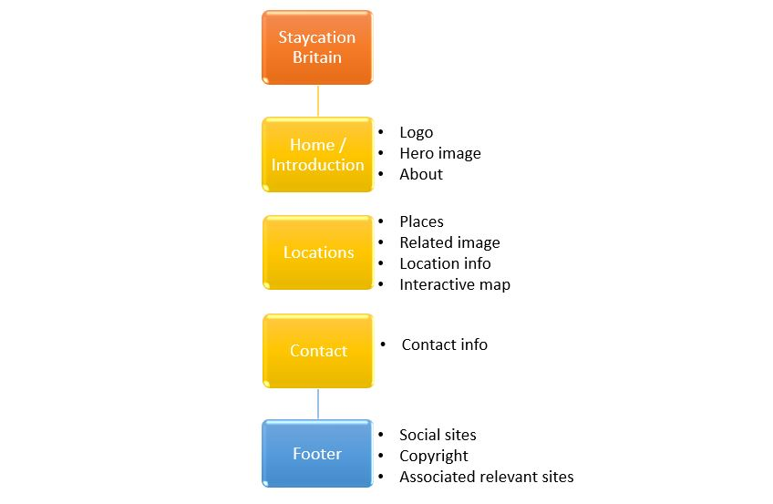

# Project Staycation Britain

[Staycation Britain website](website address when pushed)

## Contents
1. [Introduction](#Introduction)
2. [UX](#UX)
    - [Aims](#Aims)
    - [Demographic](#Demographic-both-current-and-potential)
    - [User Stories](#User-stories)
        - [Traveller](#Traveller)
        - [Web developer](#Web-Developer)
    - [Development](#Development-Plan)
        - [Strategy](#Strategy)
            - [Demographic](#Demographic)
            - [Audience](#Understanding-the-audience)
            - [Requirements](#User-requirements)
            - [Importance levels](#Levels-of-importance)
        - [Design and Scope](#Design-and-Scope)
            - [Influence](#Influence)
            - [Imagery](#Imagery)
            - [Pages](#Page-sections)
            - [Structure](#Structure)
    - [Wireframe](#Wireframe)
3. [Features](#Features)
    - [Consistency](#Consistency)
    - [Home](#Home-section)
    - [Locations](#Location-sesction)
    - [Contact](#Contact-section)
4. [Technologies Used](#Technologies-Used)
5. [Bugs and Issues](#Bugs-and-Issues)
6. [Testing](#Testing) / [Testing detail file](https://github.com/TezBaydu/Milestone-Project-1-Band/blob/master/test.md)
    - [Commits](#Commits)
    - [Code testing](#Code-testing)
    - [Element testing](#Element-testing)
    - [Device testing](#Device-testing)
    - [Colour blindness Testing](#Colour-blindness-testing)
    - [Browser testing](#Browser-testing)
    - [User testing](#User-testing)
7. [Deployment](#Deployment)
    - [Gitpod commits](#Gitpod-to-GitHub-commits)
    - [GitHub Pages Deployment](#Deploying-via-GitHub-Pages)
    - [Forking](#Forking-repository)
    - [Cloning](#Cloning-a-repository)
8. [Credits and Acknowledgements](#Credits-and-Acknowledgements)

***

## Introduction

*Staycation Britain* is a website to highlight a few recommended areas in Britain to stay.
The idea has come about due to pandemic restrictions of overseas holidays and to highlight places of interest in Britain.

This is the second project of a 4 module Full Stack Developer course provided by the [Code Institute](https://codeinstitute.net/).
Main requirements are to show understanding of JavaScript and JQuery by developing an Interactive Front End website.

[Back to top ⇧](#Project-Staycation-Britain)

## UX

### Aims

1. To give users a visual experience of a few places to visit in Britain with interactive features.

2. Easy navigation.

3. Responsive to all screens, sizes and browsers.

### Demographic both current and potential

* People in Britain who want a holiday but will not travel abroad.
* People who are interested in British places to visit
* Developers

### User stories

#### British Travellers
The user is considering a break away from home and wanting to have inspiration on places to visit
*   This user wants to:
1. Be able to navigate through the website easily.
2. Learn about places in Britain to stay.
3. Have the opportunity to find out more via official sites.
4. Be able to navigate to relevant social links.
5. Use maps to see locations and local points of interest.
6. Be able to contact company for any other queries

#### Web Developer
This user is looking for imagery or influence for another project.

* They want to be able to:
1. Have easy navigation.
2. Find how the website was created.
3. Be able to see sources for design.
4. Be able to make contact with Developer.
5. Have an opportunity to clone site if wanting to use content.

[Back to top ⇧](#Project-Staycation-Britain)

### Development Plan
Development decisions came from wanting to design a more formal site to diversify skillset.

[Back to top ⇧](#Project-Staycation-Britain)

#### Strategy
Identifying target audience.

##### Demographic
1. People in Britain who want to get away
    *18-70 years old
2. Web developers
    * 1st stage students with basic HTML, CSS, Javascript and JQuery knowledge

##### Understanding the audience
1. Personality
    * Fed up of being stuck at home.
    * People who like travelling.
    * Looking for something different to stay.
2. Lifestyle
    * Earnings could vary but enough to have a break away.
    * Families.
    * Couples wanting to get away.
    * People who live alone who want somewhere of a change to visit.

##### User requirements
1. User
    * See, understand and know where places are to visit.
    * Interactive map.
    * Have links to any other points of interest.
    * Make contact directly or through social sites.

2. Developer
    * Develop online presence through interactive actions on website.
    * Provide insight into places to visit in Britain.
    * Capture data of those wanting to travel for future communication.

##### Levels of importance
Below are areas considered for levels of importance and viability

<u>Importance</u>
1. High
    * Online presence.
    * Imagery.
    * Contact portal.
    * Map.
    * Links to places of interest.
2. Medium
    * Sales booking section.
3. Low
    * --

<u>Viability</u>
1. High
    * Online presence.
    * Imagery.
    * Links to associated sites.
2. Medium
    * Contact portal
    * Interactive map.
3. Low
    * Sales

[Back to top ⇧](#Project-Staycation-Britain)

### Design and Scope

#### Influence
1. Lockdown scenarios for over a year !
2. Images of nice places to visit:
    *

#### Imagery
1. Colours
    *   Both bright and pastel so easy on the eye.
2. Imagery
    * Associations to:
        * Beaches
        * Travelling
        * Fun

#### Page sections
1. Home
2. Location
3. Contact
*  Potential pages to develop
    1. --

#### Structure

Hierarchical structure design for simpler user navigation:

[Back to top ⇧](#Project-Staycation-Britain)

### Wireframe

- Designed in [Figma]()

- Home section

- Location section

- Contact section

[Back to top ⇧](#Project-Staycation-Britain)

## Features
This project has three main sections all in one page but is locatable by clicking relevant name in a menu bar.

### Consistency

- Design with menu placing in the same position at top.
    * A logo which leads the user back to 'Home' when clicked.
    * Mobile version to be a dropdown menu.

- Footer with links to social media and download options.

- Consistent font:
    * PT Serif
    * to use additional in case montserrat isn't available for users:
        * Ariel & sans serif

- Colours (although may vary to suit):
    * darkslava / darkslategray
        * #463730 / #433 / hsl(19,18%,23%) / rgb(70,55,48)
    * bluesapphire / darkslategray
        * #1f5673 / #257 / hsl(200,57%,28%) / rgb(31,86,115)
    * opal / darkgray
        * #9bc1bc / #acc / hsl(172,23%,68%) / rgb(155,193,188)
    * alabaster / gainsboro
        * #e6ebe0 / #efe / hsl(87,21%,89%) / rgb(230,235,224)
    * robineggblue / mediumturquoise
        * #36c9c6 / #3dc / hsl(178,57%,50%) / rgb(54,201,198)

### Home section
1. Backdrops
    - Hero beach image.
    - Typical images of fun and food associated to holiday.

2. Synopsis
    - Site description

### Location section
1. Collapsable cards of each recommended places

#### Card Collapse
1. Location image.
2. Five lines of description.
3. Read more link to open card.

#### Card Expanded
1. Location image.
2. Full text explanded.
3. Links to point of interest and relevance in text.
4. Google Map of associated location.
5. Recommended point of interest markers

### Contact section
1. Description of why to contact
2. Contact fields

[Back to top ⇧](#Project-Staycation-Britain)

## Technologies Used

- HTML5
    * Code used to provide content to the website

- CSS3
    * Code used to style content

- Javascript

- JQuery

- [Coolors - colour collage](https://coolors.co)

- [Pixabay - images](https://pixabay.com)

- [Github](https://github.com)

- [Gitpod](https://www.gitpod.io)

- [Bootstrap](https://getbootstrap.com)

- [Google fonts](https://fonts.google.com)

- [Figma](https://www.figma.com)
    * [project wireframe]

- [Font Awesome](https://fontawesome.com/v4.7.0)
    * version 4.7

- [Bootstrapcdn](https://www.bootstrapcdn.com)

- [Responsive design checker](https://responsivedesignchecker.com)

- [Am I responsive](http://ami.responsivedesign.is)

- [HTML code checker](https://validator.w3.org)

- [CSS code checker](https://jigsaw.w3.org/css-validator)

- [Extends Class JavaScript validator](https://extendsclass.com/javascript-fiddle.html)

- [Browser site testing - BrowserStack](http://browserstack.com)

- [RGBlind chrome extension]

- [Eye Dropper extension]

[Back to top ⇧](#Project-Staycation-Britain)

## Bugs and Issues

[Back to top ⇧](#Project-Staycation-Britain)

## Testing 
-   ### View [Test.md file](

### Commits

### Code Testing
- HTML 
- CSS
- JavaScript
- JQuery

### Element testing
- Ensure elements behave as expected
   
### Device testing

- [Responsive design checker](https://responsivedesignchecker.com)
- [Am I responsive](http://ami.responsivedesign.is)

### Colour blindness testing

- RGBlind Chrome extensions

### Browser testing

- Chrome
- Firefox
- Microsoft Edge
- Safari

### User Testing

- Friends & Family testing

[Back to top ⇧](#Project-Staycation-Britain)

## Deployment

### Gitpod to GitHub commits

To help with controlling versions you can commit to GitHub via Gitpod.
Once you are able to view the repository in Gitpod this is done by:

1. Access the control terminal
    - Usually found at bottom of project in "workspace" section.
2. Next to gitpod/workspace/(name of project)
    - Type "git add (and name of document you wish to commit to GitHub)".
    - If you want to find all that could be committed then you can type "git add ."
3. Type "git status"
    - This will help show what files have been modified, added or deleted for a pre-check prior to committing.
4. Type "git commit -m ("and then a brief description of latest updates in quotation marks")"
5. Type "git push"
6. Log into GitHub
    - Locate repository
    - You should be able to see the latest and history of commits in code section at top right of table of files list.
    

### Deploying via GitHub Pages

1. Log into GitHub and look for [https://github.com/TO BE UPDATED] or create an account.
2. Click on settings and ensure repository name is selected to TO BE UPDATED.
3. Scroll down to GitHub Pages section and ensure Branch is 'Master' and folder is 'root'.
4. Click save and wait for site to be published.
5. Click link in GitHub Pages section to view published site.

### Forking repository

Forking a repository in GitHub is used to make a copy of a repository which you do not have rights access to. Once you have forked a repository you will be able to make changes without affecting the original. It can also be used to suggest changes of an original project and/or propose a project as starting point.

Steps on Forking a repository:
1. Log into GitHub and look for [https://github.com/TO BE UPDATED] or create an account.
2. At the top right hand corner of the page select "Fork".
3. You should now have a copy of the original repository to work with on your account without affecting the original.

### Cloning a repository

Cloning a repository in GitHub allows you to make a copy of your own repository which will affect the original repository.
If you wish to make changes which do not affect the original then this should be forked.

Steps to Clone a repository
1. Log into GitHub and look for [https://github.com/TO BE UPDATED] or create an account.
2. Ensure "Code" has been selected in menu.
3. Select code on top right of table.
4. Select either HTTPS, SSH or CLI.
5. You can either download ZIP for static files and utilise in GitHub or open with GitHub desktop.
6. If opening with GitHub Desktop then select. If not downloaded this will need to be to utilise benefits.
7. Once opened with GitHub Desktop select "File".
8. Select "Clone repository".
9. Select GitHub and the name of the GitHub repository. (URL can also be selected and the URL applied)
10. Select repository from the sources.
11. Click "Choose".
12. Click "Clone".

For further help and info you can select [Cloning and Forking repositories](https://docs.github.com/en/desktop/contributing-and-collaborating-using-github-desktop/cloning-and-forking-repositories-from-github-desktop)

[Back to top ⇧](#Project-Staycation-Britain)

## Credits and Acknowledgements

[Back to top ⇧](#Project-Staycation-Britain)

